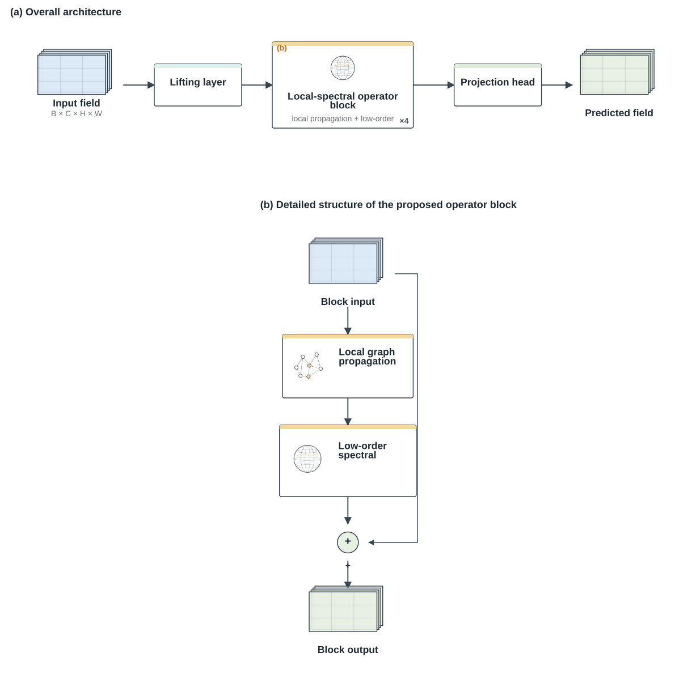

# ML Architecture Diagram Skill

[](LICENSE)
[](pyproject.toml)

A framework-neutral **Agent Skill + Architecture IR + scientific renderer toolkit** for creating accurate, publication-oriented, editable machine-learning architecture diagrams from model code, structured specifications, or prose descriptions.

The project separates architecture fidelity from figure design:

1. recover the real computation path from code/configuration;
2. normalize it into a framework-neutral Architecture IR;
3. semantically review ambiguous parser output without changing exact topology;
4. compile architecture-specific visual grammar;
5. compose evidence-backed scientific mini-illustrations;
6. derive a paper-facing publication view with provenance;
7. jointly optimize stage layout and obstacle-aware edge routing;
8. optionally expand a verified proposed block into a detailed panel;
9. export editable SVG, draw.io, and native PowerPoint shapes, plus PNG/PDF.



## Highlights

- Static PyTorch and Keras parsers that inspect common execution patterns without running user code.
- Framework-neutral Architecture IR with JSON Schema validation.
- Semantic-review workflow for complex multi-input, attention, fusion, gating, and multi-output models.
- Scientific Visual Grammar for CNNs, Transformers, U-Net/encoder-decoder models, GNNs, MoE, RNNs, diffusion models, operator learning, multimodal networks, and generic DAGs.
- Scientific Illustration Composer with editable primitives for temporal histories, fields, coordinates, graphs, spherical nodes, spectral operators, attention, uncertainty, measurement geometry, and custom vector sketches.
- Content-driven publication layout with stage sizing based on labels, illustrations, graph depth, and branch complexity.
- Obstacle-aware routing, stage gutters, semantic ports, fan-in/fan-out buses, and geometry linting.
- Joint layout optimization using routed crossings, path length, bends, and occupied area.
- Automatic `(a) Overall architecture` + `(b) Detailed proposed block` when verified block internals are available.
- Editable SVG, draw.io, and native PowerPoint output; PNG/PDF for manuscript use.
- Optional AI-reference bundle for image-model art direction while keeping deterministic vector output as the structural source of truth.

## Installation

```bash
python -m venv .venv
source .venv/bin/activate      # Windows: .venv\Scripts\activate
pip install -e '.[dev,export]'
```

For optional image-model integration:

```bash
pip install -e '.[ai]'
```

## Quick start

### Parse a PyTorch model

```bash
ml-arch parse-pytorch examples/pytorch/residual_cnn.py \
  --class ResidualCNN \
  --output build/residual.yaml
```

### Parse a Keras model

```bash
ml-arch parse-keras examples/keras/functional_fusion.py \
  --output build/keras.yaml
```

### Review a complex model

For non-trivial source models, inspect the parsed IR and active execution path before creating the paper figure:

```bash
ml-arch parse-pytorch examples/pytorch/complex_multibranch.py \
  --class ComplexFusionNet \
  --output build/complex.yaml

ml-arch apply-review build/complex.yaml \
  examples/pytorch/complex_multibranch.review.yaml \
  --output build/complex.reviewed.yaml
```

The review patch may improve paper-facing labels, roles, shapes, and overview hints, but it may not add or delete exact graph nodes or edges.

### Compile the publication figure

```bash
ml-arch compile-publication build/complex.reviewed.yaml \
  --output build/complex.paper.yaml

ml-arch lint-publication build/complex.paper.yaml

ml-arch render build/complex.paper.yaml \
  --format svg pptx drawio png pdf
```

### Inspect layout quality

```bash
ml-arch layout-metrics build/complex.paper.yaml
```

### Proposed-block detail

For a custom block, inspect its implementation and record verified internals in `node.detail`. You can generate a review skeleton with:

```bash
ml-arch detail-review build/complex.reviewed.yaml \
  --output build/proposed-block-review.yaml
```

After the block internals are verified and applied, publication compilation can produce an overall panel plus a detailed proposed-block panel. Unknown custom internals are never invented merely to fill a figure.

## Architecture IR

The normalized YAML/JSON representation is the contract between parsers, Agents, layout, and renderers. It captures:

- inputs, internal nodes, outputs, and panels;
- semantic roles and groups;
- edges and edge types;
- repeats and reliable tensor shapes;
- visual and scientific-illustration metadata;
- publication-view provenance;
- unresolved facts that should not be presented as certain.

See [`templates/architecture_spec.yaml`](templates/architecture_spec.yaml) and [`templates/architecture.schema.json`](templates/architecture.schema.json).

## Scientific illustration

The renderer does not need to reduce every concept to a plain rectangle. Selected modules may carry an evidence-backed `illustration` plan. Built-in primitives are supplemented by a safe custom vector DSL using simple shapes, lines, polylines, polygons, and text. Scientific sketches are symbolic; they must not fabricate experimental observations.

See [`references/scientific-illustration.md`](references/scientific-illustration.md).

## Agent Skill

`SKILL.md` defines the recommended Agent/Codex workflow. The Agent should recover the true execution graph first, then decide the appropriate publication abstraction, local scientific illustrations, and detail hierarchy. Visual sophistication must never override topology fidelity.

## Validation

```bash
pytest -q
python scripts/render_examples.py --formats svg drawio
```

## Repository structure

```text
SKILL.md
src/ml_architecture_diagram/
templates/
references/
docs/
examples/
tests/
evals/
scripts/
.github/
```

## Contributing

Contributions are welcome. Parser changes should preserve execution-path fidelity, and visual changes should remain editable and scientifically defensible. See [`CONTRIBUTING.md`](CONTRIBUTING.md).

## License

MIT. See [`LICENSE`](LICENSE).
